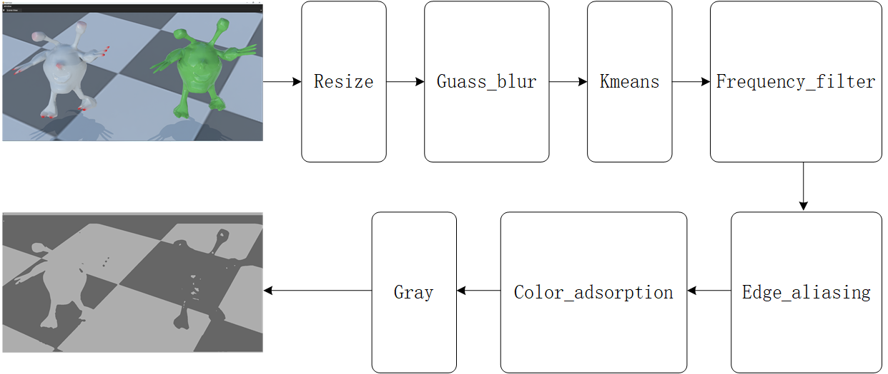
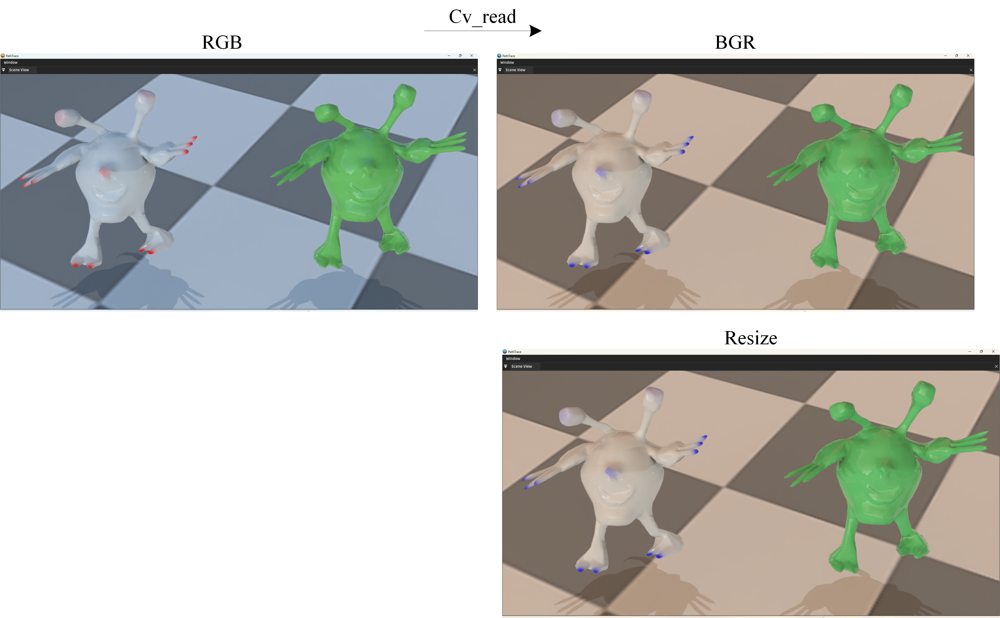
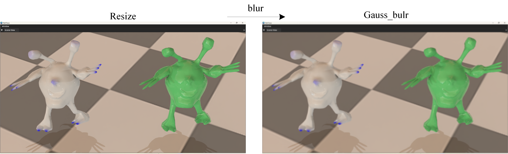
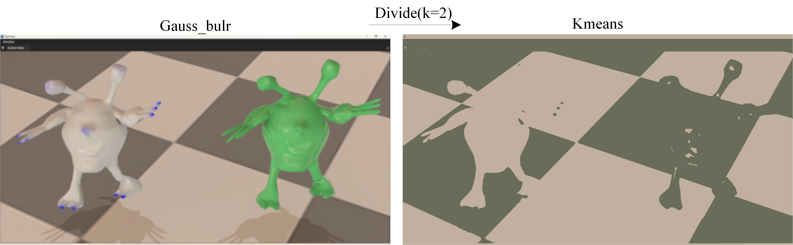
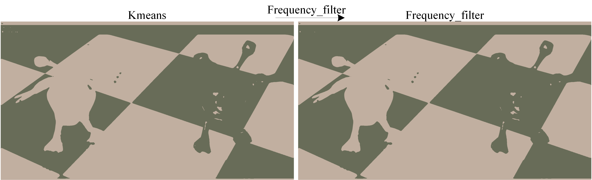
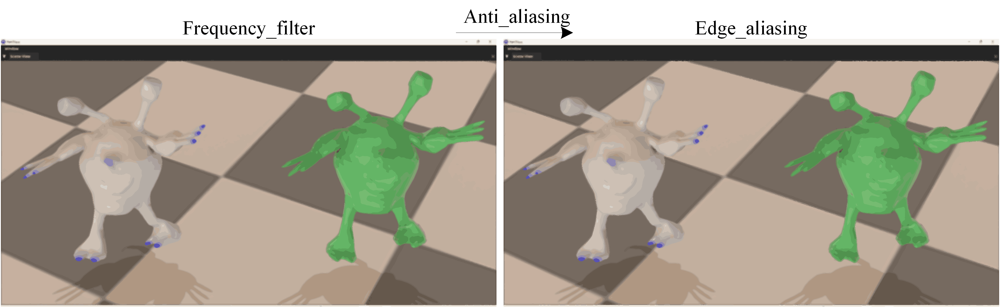
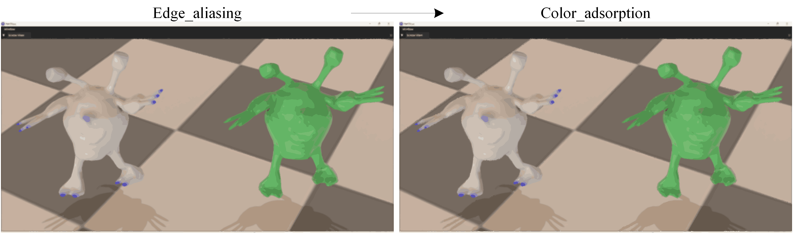
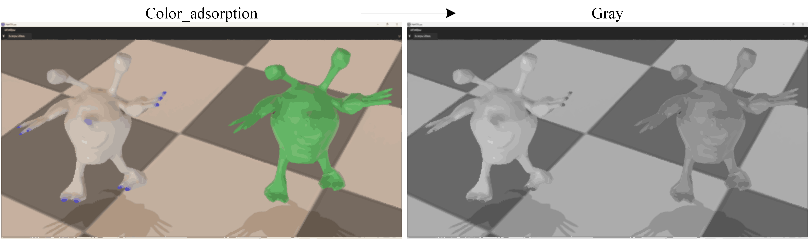

# nous中的图像处理

------

## 1. 整体流程

**目标**：输入一个二维纹理，输出处理后的二维纹理。输入纹理可以是任意的RGB图像，经过处理后输出的纹理通常携带了类别信息，即对原纹理的二维像素进行了分类。

**处理过程**：分为7个子步骤，每个步骤可以根据需要跳过不处理。

如下图所示：输入一个任意的二维纹理，经过Resize、Guass_blur、Kmeans、Frequency_filter、Edge_aliasing、Color_adsorption、Gray,这个7个过程，得到一张携带类别信息的二维纹理。



## 2. Resize

等比缩放到宽为特定值。

```c++
if(param.resize_checked)
{
    if(param.force_resize || image.width() > param.resize)
    {
        auto scale = param.resize / static_cast<float>(image.width());

    }
}
```

参数：特定宽度。



## 3. Guass_blur

根据卷积核大小，对像素邻域进行加权平均。代码中卷积核大小是固定值

```c++
if(param.gauss_blur)
{
    constexpr uint32 vertical_gauss_kernel_size = 5;
    constexpr uint32 horizontal_gauss_kernel_size = 5;
    image.gauss_blur(param.gauss_iter, vertical_gauss_kernel_size,horizontal_gauss_kernel_size,param.sigma);
}
```

参数：param.gauss_iter，param.sigma



## 4. Kmeans

对二维纹理进行聚类，将二维纹理的像素分为K个类别，每个像素的颜色为其类别对应的颜色。其中每个类别的颜色由聚类算法根据中心值得到。

```c++
if(param.divide)
{
    constexpr uint32 kmeans_max_iterations = 10;
    constexpr scalar epsilon = 0.1;
    image.kmeans(param.k, kmeans_max_iterations, epsilon);
}
```

参数：param.k



## 5. Frequency_filter

对二维纹理的每个像素进行频数替换，方式为检测每个像素周围的所有像素中出现最多的一类颜色（类别），将其颜色（类别）更为这个最多的颜色（最多的类别）。

```c++
if(param.frequency_filter_checked)
{
    image.frequency_filter(param.frequency_filter);
}
```

参数：param.frequency_filter。（检测像素的周围范围的大小）



## 6. edge_aliasing

从二维纹理中寻找判定为edge的像素，对这些edge像素周围kernalxkernal的范围内(每一个邻域像素)进行Frequency_filter（像素颜色取众数）。



## 7.color_adsorption

对像素进行遍历，对每个像素进行判断：若这个像素类别对应的总像素数量过少小于指定阈值。将根据类别的相邻关系，将这个像素的类别替换最多像素数量的那个类别。

```c++
if(param.color_adsorption_checked)
{
    image.color_adsorption(param.color_adsorption);
}
```

参数：param.color_adsorption。（数量阈值）



## 8.Gray

将纹理转换成灰度纹理。



## 9.代码

NousImage处理的代码

```c++
class NousImage
{
private:
    cv::Mat m_image;
    std::filesystem::path m_file_path;

public:
    explicit NousImage(const std::filesystem::path& file_path)
    {
        m_file_path = file_path;
        load_image();
    }
    explicit NousImage(const cv::Mat& image) { m_image = image; }
    NousImage(const NousImage& other) = default;
    NousImage& load_image()
    {
        if(std::filesystem::exists(m_file_path))
        {
            m_image = imread(m_file_path.generic_u8string(), IMREAD_COLOR);
            if(m_image.empty())
            {
                int32 rows, cols, channels;
                auto img_data = read_image_by_stb_img(m_file_path, cols, rows, channels);
                if(img_data)
                {
                    m_image = cv::Mat(rows, cols, CV_8UC(channels), img_data);
                    if(channels == 4)
                    {
                        cv::cvtColor(m_image, m_image, cv::COLOR_RGBA2RGB);
                    }
                    else if(channels == 1 || channels == 2)
                    {
                        cv::cvtColor(m_image, m_image, cv::COLOR_GRAY2RGB);
                    }
                }
                else
                {
                    nous::log_error("Error: Unable to open image file :{}", m_file_path.generic_u8string());
                }
            }
            else
            {
                cv::cvtColor(m_image, m_image, cv::COLOR_BGR2RGB);
            }
        }
        return *this;
    }

public:
    static void save(const cv::Mat& image, const std::string& file_path) { imwrite(file_path, image); }
    void save(const std::string& file_path) const { imwrite(file_path, m_image); }
    void show(StringView label = "image") const
    {
        cv::imshow(label.data(), m_image);
        cv::waitKey(0);
    }

public:
    [[nodiscard]] bool is_valid() const { return m_image.data; }
    [[nodiscard]] int32 width() const { return m_image.cols; }
    [[nodiscard]] int32 height() const { return m_image.rows; }
    [[nodiscard]] int32 channels() const { return m_image.channels(); }
    unsigned char* data() const { return m_image.data; }

public:
    color sample(float u, float v, WrapMode method = WrapMode::Clamp) const
    {
        int32 x = static_cast<int32>(u * (width() - 1));
        int32 y = static_cast<int32>(v * (height() - 1));

        // see https://stackoverflow.com/questions/59287642/implement-opengl-like-mirrored-repeat
        // see https://www.khronos.org/registry/OpenGL/specs/gl/glspec46.core.pdf page 260
        auto mod = [](int32 a, int32 b) { return (a % b + b) % b; };
        switch(method)
        {
        case WrapMode::Clamp: {
            x = std::clamp(x, 0, width() - 1);
            y = std::clamp(y, 0, height() - 1);
            break;
        }
        case WrapMode::Repeat: {
            x = mod(x, width());
            y = mod(y, height());
            break;
        }
        case WrapMode::MirrorRepeat: {
            auto mirror = [](int32 v) { return v >= 0 ? v : -(1 + v); };
            x = (width() - 1) - mirror(mod(x, 2 * width()) - width());
            y = (height() - 1) - mirror(mod(y, 2 * height()) - height());
            break;
        }
        }

        const int32 idx = (y * width() + x) * channels();
        color result;
        for(int32 i = 0; i < channels(); ++i)
            result.data()[i] = data()[idx + i] / 255.0f;
        return result;
    }

public:// convert
    NousImage& hsv_to_bgr()
    {
        cv::cvtColor(m_image, m_image, cv::COLOR_HSV2BGR);
        return *this;
    }
    NousImage& bgr_to_hsv()
    {
        cv::cvtColor(m_image, m_image, cv::COLOR_BGR2HSV);
        return *this;
    }
    NousImage& bgr_to_gray()
    {
        cv::cvtColor(m_image, m_image, COLOR_BGR2GRAY);
        return *this;
    }
    NousImage& rgb_to_gray()
    {
        cvtColor(m_image, m_image, COLOR_RGB2GRAY);
        return *this;
    }
    NousImage& gray_to_rgb()
    {
        cvtColor(m_image, m_image, COLOR_GRAY2RGB);
        return *this;
    }

private:// read image by stb_img
    unsigned char* read_image_by_stb_img(const std::filesystem::path& file_path, int32& width, int32& height, int32& channels)
    {
#ifdef OS_WIN
        FILE* fp = _wfopen(file_path.generic_wstring().c_str(), L"rb");
#else
        FILE* fp = fopen(file_path.generic_u8string().c_str(), "rb");
#endif
        if(!fp)
        {
            printf("Failed to open file\n");
            return nullptr;
        }

        // 获取文件大小
        fseek(fp, 0, SEEK_END);
        const long file_size = ftell(fp);
        fseek(fp, 0, SEEK_SET);

        // 分配内存缓冲区
        unsigned char* buffer = (unsigned char*)malloc(file_size);
        if(!buffer)
        {
            printf("Failed to allocate memory\n");
            fclose(fp);
            return nullptr;
        }

        // 读取文件数据到缓冲区
        const size_t bytes_read = fread(buffer, 1, file_size, fp);
        fclose(fp);

        if(bytes_read != file_size)
        {
            printf("Failed to read file\n");
            free(buffer);
            return nullptr;
        }

        // 从内存缓冲区加载图像
        unsigned char* image_data = stbi_load_from_memory(buffer, file_size, &width, &height, &channels, 0);
        free(buffer);

        if(image_data)
        {
            // stb_image获取到的值：
            //     N=#comp     components
            //     1           grey
            //     2           grey, alpha
            //     3           red, green, blue
            //     4           red, green, blue, alpha

            unsigned char* src_data = image_data;
            unsigned char* result = (unsigned char*)malloc((size_t)height * (size_t)width * channels * sizeof(unsigned char));
            unsigned char* result_data = result;
            switch(channels)
            {
            case 1: {
                for(auto j = 0; j < height; j++)
                {
                    for(auto i = 0; i < width; i++)
                    {
                        result_data[0] = src_data[0];
                        result_data += 1;
                        src_data += 1;
                    }
                }
                break;
            }
            case 2: {
                for(auto j = 0; j < height; j++)
                {
                    for(auto i = 0; i < width; i++)
                    {
                        result_data[0] = src_data[0];
                        result_data[1] = src_data[1];
                        result_data += 2;
                        src_data += 2;
                    }
                }
                break;
            }
            case 3: {
                for(auto j = 0; j < height; j++)
                {
                    for(auto i = 0; i < width; i++)
                    {
                        result_data[0] = src_data[0];
                        result_data[1] = src_data[1];
                        result_data[2] = src_data[2];
                        result_data += 3;
                        src_data += 3;
                    }
                }
                break;
            }
            case 4: {
                for(auto j = 0; j < height; j++)
                {
                    for(auto i = 0; i < width; i++)
                    {
                        result_data[0] = src_data[0];
                        result_data[1] = src_data[1];
                        result_data[2] = src_data[2];
                        result_data[3] = src_data[3];
                        result_data += 4;
                        src_data += 4;
                    }
                }
                break;
            }
            default: {
                free(result);
                result = nullptr;
                break;
            }
            }

            stbi_image_free(image_data);
            return result;
        }

        printf("Failed to load image from memory\n");
        return nullptr;
    }

private:
    struct CompareVec3b
    {
        bool operator()(const Vec3b& a, const Vec3b& b) { return a[0] < b[0] || (a[0] == b[0] && (a[1] < b[1] || (a[1] == b[1] && a[2] < b[2]))); };
    };
    /**
     * @brief get most frequent pixel value in the kernel_size×kernel_size
     */
    Vec3b get_frequency_pixel(const Mat& src_image, int32 x, int32 y, int32 kernel_size)
    {
        // using SortedMap=std::map
        SortedMap<Vec3b, int32, NousImage::CompareVec3b> frequency;
        const int32 radius = kernel_size / 2;

        // Determine the window boundaries, handling edge cases
        int32 row_start = stl::max(x - radius, 0);
        int32 row_end = stl::min(x + radius, src_image.rows - 1);
        int32 col_start = stl::max(y - radius, 0);
        int32 col_end = stl::min(y + radius, src_image.cols - 1);

        // Adjust window size dynamically to ensure at least kernel_size x kernel_size pixels
        const int32 min_window_size = kernel_size * kernel_size;
        while((row_end - row_start + 1) * (col_end - col_start + 1) < min_window_size)
        {
            if(row_start > 0)
                --row_start;
            else if(row_end < src_image.rows - 1)
                ++row_end;

            if(col_start > 0)
                --col_start;
            else if(col_end < src_image.cols - 1)
                ++col_end;
        }

        // Find the mode value
        int32 max_count = 0;
        Vec3b mode_value = Vec3b(0, 0, 0);
        // Collect frequencies of pixel values within the window
        for(auto ki = row_start; ki <= row_end; ++ki)
        {
            for(auto kj = col_start; kj <= col_end; ++kj)
            {
                auto&& pixel_value = src_image.at<Vec3b>(ki, kj);
                auto&& freq = frequency[pixel_value];
                freq++;
                if(freq > max_count)
                {
                    max_count = freq;
                    mode_value = pixel_value;
                }
            }
        }

        return mode_value;
    }
    int32 get_color_block(const Mat& image, Mat& color_block, int32 x, int32 y)
    {
        // 当前像素没有颜色分类
        constexpr int32 dx[8] = { 1, -1, 0, 0, -1, -1, 1, 1 };
        constexpr int32 dy[8] = { 0, 0, 1, -1, -1, 1, -1, 1 };
        // constexpr int32 dx[4] = { 1, -1, 0, 0 };
        // constexpr int32 dy[4] = { 0, 0, 1, -1 };

        auto current_color = image.at<Vec3b>(x, y);
        for(auto i = 0; i < 8; ++i)
        {
            const auto nx = x + dx[i];
            const auto ny = y + dy[i];
            if(nx < 0 || nx >= image.rows || ny < 0 || ny >= image.cols)
            {
                continue;
            }

            if(!color_block.at<int32>(nx, ny))// 如果相邻的像素没有颜色分类
            {
                continue;
            }

            auto neighbor_color = image.at<Vec3b>(nx, ny);
            if((int32)current_color[0] == (int32)neighbor_color[0] && (int32)current_color[1] == (int32)neighbor_color[1] &&
               (int32)current_color[2] == (int32)neighbor_color[2])
            {
                return color_block.at<int32>(nx, ny);
            }
        }
        return 0;
    }

public:
    NousImage& resize(uint32 x, uint32 y)
    {
        cv::resize(m_image, m_image, cv::Size(x, y));
        return *this;
    }
    NousImage& extract_edge(double threshold1, double threshold2)
    {
        cv::Canny(m_image, m_image, threshold1, threshold2);
        return *this;
    }
    NousImage& gauss_blur(uint32 iter_num, uint32 x_kernel_num, uint32 y_kernel_num, uint32 sigma)
    {
        // params check
        iter_num = (iter_num < 1 || iter_num > 20) ? 3 : iter_num;
        x_kernel_num = (x_kernel_num < 1 || x_kernel_num > 21) ? 5 : x_kernel_num;
        y_kernel_num = (y_kernel_num < 1 || y_kernel_num > 21) ? 5 : y_kernel_num;
        sigma = (sigma < 1 || sigma > 20) ? 3 : sigma;
        x_kernel_num = (x_kernel_num % 2 == 0) ? x_kernel_num + 1 : x_kernel_num;
        y_kernel_num = (y_kernel_num % 2 == 0) ? y_kernel_num + 1 : y_kernel_num;
        for(size_t i = 0; i < iter_num; i++)
        {
            GaussianBlur(m_image, m_image, Size(x_kernel_num, y_kernel_num), sigma);
        }
        return *this;
    }
    /**
     * @brief  Finds centers of clusters and groups input samples around the clusters.
     * @param K Number of clusters to split the set by
     * @param max_iterations the maximum number
     * @param epsilon The accuracy is specified as criteria.epsilon. As soon as each of the cluster centers moves by less than criteria.epsilon on
     * some iteration, the algorithm stops.
     */
    NousImage& kmeans(uint32 k, uint32 max_iterations, float epsilon)
    {
        // params check
        k = (k < 1 || k > 30) ? 3 : k;
        max_iterations = (max_iterations < 1 || max_iterations > 10) ? 5 : max_iterations;
        epsilon = (epsilon < 0.1 || epsilon > 10) ? 1.0 : epsilon;

        // 转换图像数据格式以适应kmeans
        Mat data;
        m_image.convertTo(data, CV_32F);
        data = data.reshape(1, m_image.rows * m_image.cols);

        Mat labels, centers;
        cv::kmeans(data, k, labels, TermCriteria(TermCriteria::EPS + TermCriteria::COUNT, max_iterations, epsilon), 5, KMEANS_PP_CENTERS, centers);

        // 处理聚类中心，将其转换为正确的形状
        centers = centers.reshape(m_image.channels(), k);

        // 创建聚类结果图像
        cv::Mat output(m_image.size(), m_image.type());

        auto tp = m_image.type();
        for(int32 y = 0; y < m_image.rows; y++)
        {
            for(int32 x = 0; x < m_image.cols; x++)
            {
                const int32 cluster_idx = labels.at<int32>(y * m_image.cols + x);
                auto&& center = centers.at<cv::Vec3f>(cluster_idx);
                auto pixel = { static_cast<uchar>(center[0]), static_cast<uchar>(center[1]), static_cast<uchar>(center[2]) };
                output.at<cv::Vec3b>(y, x) = pixel;
            }
        }
        m_image = output;
        return *this;
    }
    /**
     * @brief make edge aliasing
     */
    NousImage& anti_aliasing_filter(uint32 kernel_size)
    {
        if(kernel_size < 3)
        {
            kernel_size = 3;
        }
        else if(kernel_size > 7)
        {
            kernel_size = 7;
        }

        kernel_size = kernel_size % 2 == 0 ? kernel_size + 1 : kernel_size;

        Mat src_image = m_image.clone();
        rgb_to_gray().extract_edge(50, 100);

        Array<Pair<int32, int32>> edge_pixel;
        for(auto i = 0; i < m_image.rows; ++i)
        {
            for(auto j = 0; j < m_image.cols; ++j)
            {
                // Apply mode filter on the edge pixels and their neighbors
                if(m_image.at<uchar>(i, j) == 255)
                {
                    edge_pixel.push_back(Pair<int32, int32>{ i, j });
                }
            }
        }
        stl::atomic_flag m_flag = ATOMIC_FLAG_INIT;
        Mat result = src_image.clone();
        nous::parallel_for_light_items(nous::BlockedRange(edge_pixel.size()), [&](const auto& range) {
            for(auto index: range.index_range())
            {
                auto [i, j] = edge_pixel[index];
                // Apply the mode value to the current pixel and its 3x3 neighborhood
                for(auto ki = max(i - 1, 0); ki <= min(i + 1, m_image.rows - 1); ++ki)
                {
                    for(auto kj = max(j - 1, 0); kj <= min(j + 1, m_image.cols - 1); ++kj)
                    {
                        auto mode_value = get_frequency_pixel(src_image, ki, kj, kernel_size);
                        while(m_flag.test_and_set(stl::memory_order_acquire))
                            ;
                        result.at<Vec3b>(ki, kj) = mode_value;
                        m_flag.clear(stl::memory_order_release);
                    }
                }
            }
        });

        m_image = result;
        return *this;
    }
    /**
     * @brief frequency_filter
     */
    NousImage& frequency_filter(uint32 kernel_size)
    {
        if(kernel_size < 3)
        {
            kernel_size = 3;
        }
        else if(kernel_size > 7)
        {
            kernel_size = 7;
        }
        kernel_size = kernel_size % 2 == 0 ? kernel_size + 1 : kernel_size;

        cv::Mat result = m_image.clone();
        for(auto i = 0; i < m_image.rows; i++)
        {
            for(auto j = 0; j < m_image.cols; j++)
            {
                auto mode_value = get_frequency_pixel(m_image, i, j, kernel_size);
                result.at<Vec3b>(i, j) = mode_value;
            }
        }
        m_image = result;
        return *this;
    }
    /**
     * @brief color_adsorption to neighbor pixel
     */
    NousImage& color_adsorption(uint32 threshold)
    {
        threshold = threshold < 0 || threshold > 100 ? 20 : threshold;

        if(threshold < 0 || threshold > 100)
        {
            threshold = 20;
        }
        Mat color_block = Mat::zeros(m_image.size(), CV_32S);// 用来记录图像中的每个像素点是否已经被访问过
        SortedMap<int32, Array<vec2i>> color_pixel_map;
        SortedMap<int32, SortedSet<int32>> color_block_neighbors;

        auto set_color_block_neighbor = [&](auto x, auto y) {
            // constexpr int32 dx[4] = { 1, -1, 0, 0 };
            // constexpr int32 dy[4] = { 0, 0, 1, -1 };
            constexpr int32 dx[8] = { 1, -1, 0, 0, -1, -1, 1, 1 };
            constexpr int32 dy[8] = { 0, 0, 1, -1, -1, 1, -1, 1 };

            auto current_class = color_block.at<int32>(x, y);
            for(auto i = 0; i < 8; ++i)
            {
                const int32 nx = x + dx[i];
                const int32 ny = y + dy[i];
                if(nx < 0 || nx >= color_block.rows || ny < 0 || ny >= color_block.cols)
                {
                    continue;
                }

                auto neighbor_class = color_block.at<int32>(nx, ny);
                if(neighbor_class)// 相邻像素有颜色分类
                {
                    color_block_neighbors[current_class].insert(neighbor_class);
                    color_block_neighbors[neighbor_class].insert(current_class);
                }
            }
        };

        for(auto i = 0; i < m_image.rows; ++i)
        {
            for(auto j = 0; j < m_image.cols; ++j)
            {
                if(color_block.at<int32>(i, j))// 如果当前像素已有颜色分类
                {
                    continue;
                }

                auto re = get_color_block(m_image, color_block, i, j);
                if(re)
                {
                    color_pixel_map.at(re).push_back(vec2i(i, j));
                    color_block.at<int32>(i, j) = re;
                }
                else
                {// 当前像素是一个新的颜色分类
                    auto color_index = color_pixel_map.size() + 1;
                    color_pixel_map.emplace(color_index, Array<vec2i>{ vec2i(i, j) });
                    color_block.at<int32>(i, j) = color_index;
                }
                // 添加block邻接关系
                set_color_block_neighbor(i, j);
            }
        }

        // 颜色处理
        Mat src_image = m_image.clone();
        for(auto& [color_index, pixels]: color_pixel_map)
        {
            if(pixels.size() < threshold)
            {
                auto max_index = color_index;
                auto&& neighbors = color_block_neighbors.at(color_index);
                for(auto neighbor_color_index: neighbors)
                {
                    if(color_pixel_map.at(neighbor_color_index).size() > pixels.size())
                    {
                        max_index = neighbor_color_index;
                    }
                }
                if(max_index != color_index)
                {
                    auto coord = color_pixel_map.at(max_index)[0];
                    auto color = src_image.at<Vec3b>(coord.x(), coord.y());
                    for(auto& p: pixels)
                    {
                        m_image.at<Vec3b>(p.x(), p.y()) = color;
                    }
                }
            }
        }
        return *this;
    }
};

```

